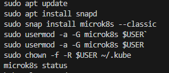
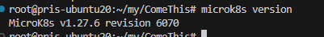
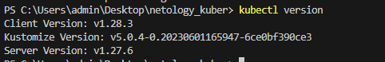
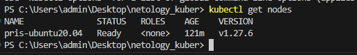
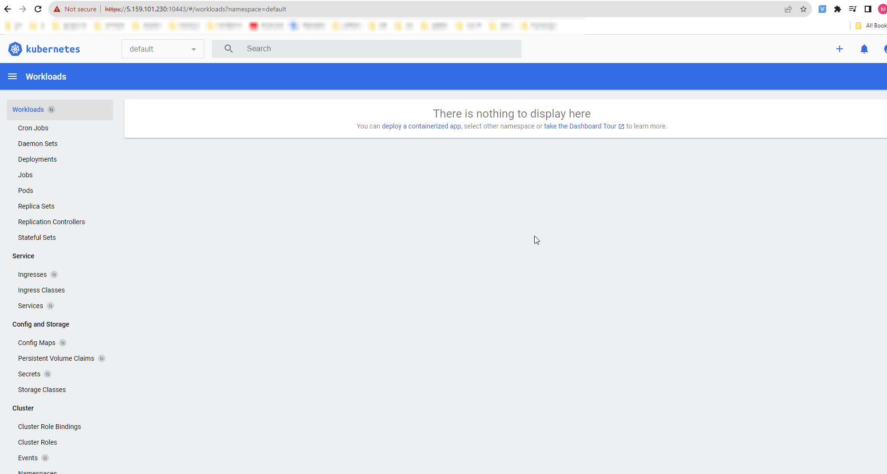

# Домашнее задание к занятию «Kubernetes. Причины появления. Команда kubectl»

### Ответы

------


### Задание 1. Установка MicroK8S

1. Установить MicroK8S на локальную машину или на удалённую виртуальную машину.


2. Установить dashboard.
```
microk8s enable dashboard
**  kubectl apply -f https://raw.githubusercontent.com/kubernetes/dashboard/v2.7.0/aio/deploy/recommended.yaml
microk8s kubectl port-forward --address 0.0.0.0 -n kube-system service/kubernetes-dashboard 10443:443
kubectl -n kube-system get secret - просмотр всех сервисов
kubectl -n kube-system describe secret  microk8s-dashboard-token  -  вывод токена для авторизации
```


3. Сгенерировать сертификат для подключения к внешнему ip-адресу.
```
1. отредактировать файл /var/snap/microk8s/current/certs/csr.conf.template
IP.3 = 5.159.101.230

2. sudo microk8s refresh-certs --cert front-proxy-client.crt
3. Изменил ip адрес подключения в файле %userprofile%/.kube/config
 server: https://5.159.101.230:16443
```
------

### Задание 2. Установка и настройка локального kubectl
1. Установить на локальную машину kubectl.

2. Настроить локально подключение к кластеру.

3. Подключиться к дашборду с помощью port-forward.


------

### Правила приёма работы

1. Домашняя работа оформляется в своём Git-репозитории в файле README.md. Выполненное домашнее задание пришлите ссылкой на .md-файл в вашем репозитории.
2. Файл README.md должен содержать скриншоты вывода команд `kubectl get nodes` и скриншот дашборда.

------

### Критерии оценки
Зачёт — выполнены все задания, ответы даны в развернутой форме, приложены соответствующие скриншоты и файлы проекта, в выполненных заданиях нет противоречий и нарушения логики.

На доработку — задание выполнено частично или не выполнено, в логике выполнения заданий есть противоречия, существенные недостатки.
