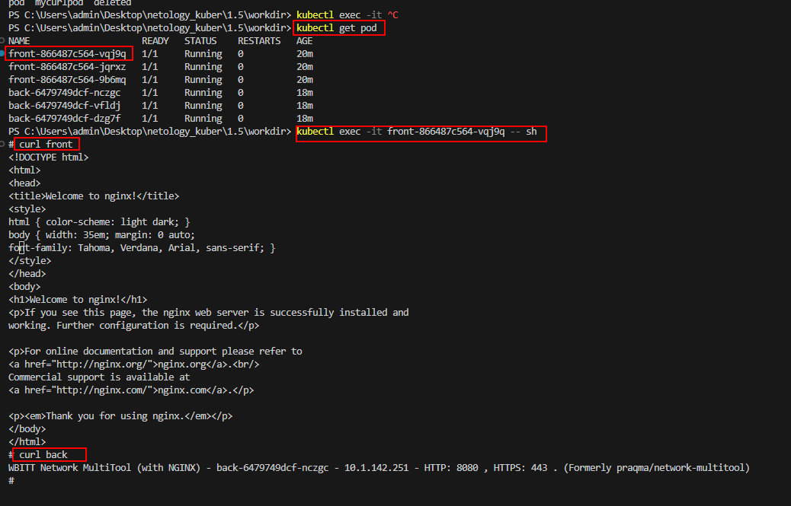
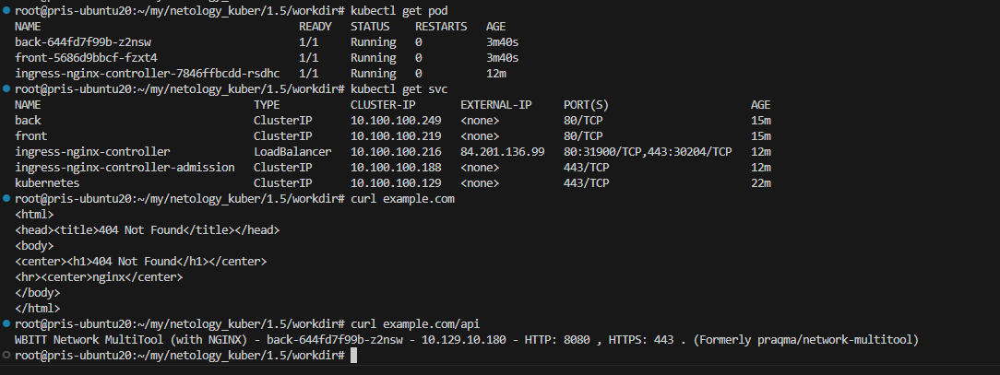

# Домашнее задание к занятию «Сетевое взаимодействие в K8S. Часть 2»


------

------


------

### Задание 1. Создать Deployment приложений backend и frontend

1. Создать Deployment приложения _frontend_ из образа nginx с количеством реплик 3 шт.


front.yaml

```
apiVersion: apps/v1
kind: Deployment
metadata:
  name: front
spec:
  replicas: 3
  selector:
    matchLabels:
      app: front
  template:
    metadata:
      labels:
        app: front
    spec:
      containers:
      - name: front
        image: nginx
        ports:
        -  containerPort: 80
```


2. Создать Deployment приложения _backend_ из образа multitool. 

back.yaml

```
apiVersion: apps/v1
kind: Deployment
metadata:
  name: back
spec:
  replicas: 3
  selector:
    matchLabels:
      app: back
  template:
    metadata:
      labels:
        app: back
    spec:
      containers:
      - name: multitool
        image: wbitt/network-multitool
        env:
        - name: HTTP_PORT
          value: "8080"
        ports:
        - containerPort: 1180
          name: http-port

```

3. Добавить Service, которые обеспечат доступ к обоим приложениям внутри кластера. 

service-front.yaml
```
apiVersion: v1
kind: Service
metadata:
  name: front
spec:
  selector:
    app: front
  ports:
    - name:  front
      protocol: TCP
      port:  80
      targetPort: 80
```

service-back.yaml

```

apiVersion: apps/v1
kind: Deployment
metadata:
  name: back
spec:
  replicas: 3
  selector:
    matchLabels:
      app: back
  template:
    metadata:
      labels:
        app: back
    spec:
      containers:
      - name: multitool
        image: wbitt/network-multitool
        env:
        - name: HTTP_PORT
          value: "8080"
        ports:
        - containerPort: 1180
          name: http-port
```

4. Продемонстрировать, что приложения видят друг друга с помощью Service.



5. Предоставить манифесты Deployment и Service в решении, а также скриншоты или вывод команды п.4.


------

### Задание 2. Создать Ingress и обеспечить доступ к приложениям снаружи кластера

1. Включить Ingress-controller в MicroK8S.
2. Создать Ingress, обеспечивающий доступ снаружи по IP-адресу кластера MicroK8S так, чтобы при запросе только по адресу открывался _frontend_ а при добавлении /api - _backend_.
3. Продемонстрировать доступ с помощью браузера или `curl` с локального компьютера.



4. Предоставить манифесты и скриншоты или вывод команды п.2.

[ingress.yaml](https://github.com/djohnii/netology_kuber/blob/main/1.5/workdir/ingress.yaml)
https://github.com/djohnii/netology_kuber/blob/main/1.5/workdir/back.yaml
https://github.com/djohnii/netology_kuber/blob/main/1.5/workdir/front.yaml
https://github.com/djohnii/netology_kuber/blob/main/1.5/workdir/service-back.yaml
https://github.com/djohnii/netology_kuber/blob/main/1.5/workdir/service-front.yaml
------

### Правила приема работы

1. Домашняя работа оформляется в своем Git-репозитории в файле README.md. Выполненное домашнее задание пришлите ссылкой на .md-файл в вашем репозитории.
2. Файл README.md должен содержать скриншоты вывода необходимых команд `kubectl` и скриншоты результатов.
3. Репозиторий должен содержать тексты манифестов или ссылки на них в файле README.md.

------
