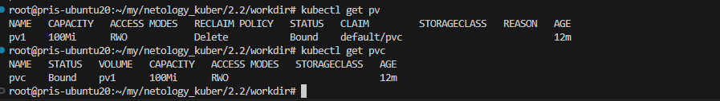
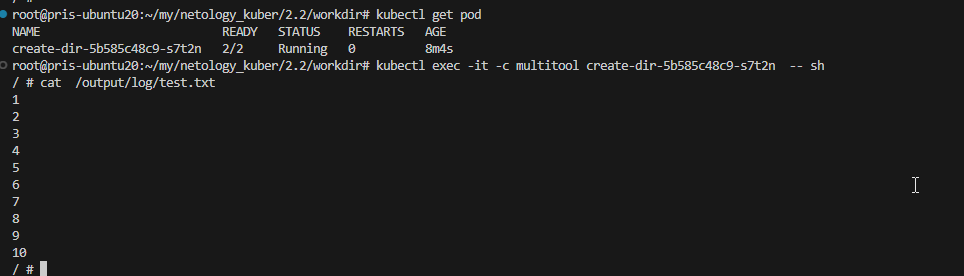
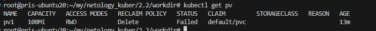
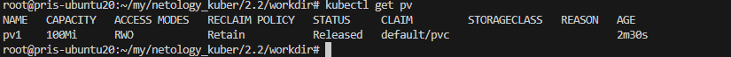
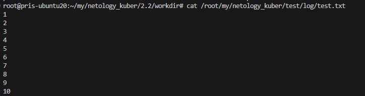
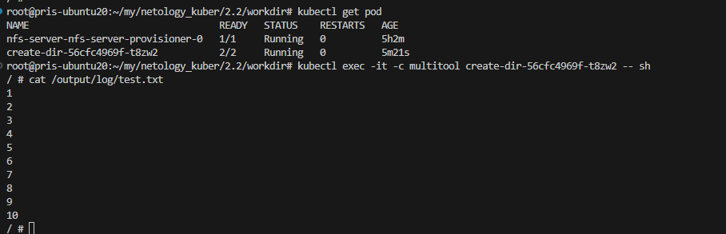
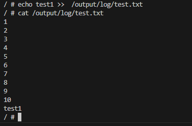

# Домашнее задание к занятию «Хранение в K8s. Часть 2»

------

------

### Дополнительные материалы для выполнения задания

1. [Инструкция по установке NFS в MicroK8S](https://microk8s.io/docs/nfs). 
2. [Описание Persistent Volumes](https://kubernetes.io/docs/concepts/storage/persistent-volumes/). 
3. [Описание динамического провижининга](https://kubernetes.io/docs/concepts/storage/dynamic-provisioning/). 
4. [Описание Multitool](https://github.com/wbitt/Network-MultiTool).

------

### Задание 1

**Что нужно сделать**

Создать Deployment приложения, использующего локальный PV, созданный вручную.

1. Создать Deployment приложения, состоящего из контейнеров busybox и multitool.
2. Создать PV и PVC для подключения папки на локальной ноде, которая будет использована в поде.

3. Продемонстрировать, что multitool может читать файл, в который busybox пишет каждые пять секунд в общей директории. 

4. Удалить Deployment и PVC. Продемонстрировать, что после этого произошло с PV. Пояснить, почему.

если в pv.yaml указать ``persistentVolumeReclaimPolicy: Delete``  то статус RECLAIM POLICY будет Delete те диск удалится. Если удалить это значение то иск останется.

5. Продемонстрировать, что файл сохранился на локальном диске ноды. Удалить PV.  Продемонстрировать что произошло с файлом после удаления PV. Пояснить, почему.

посе удаления pv файлы остаются т.к. все файлы хранятс на ноде.
6. Предоставить манифесты, а также скриншоты или вывод необходимых команд.

[deployment.yaml](https://github.com/djohnii/netology_kuber/blob/main/2.2/workdir/deployment.yaml)

[pv.yaml](https://github.com/djohnii/netology_kuber/blob/main/2.2/workdir/pv.yaml)

[pvc.yaml](https://github.com/djohnii/netology_kuber/blob/main/2.2/workdir/pvc.yaml)

------

### Задание 2

**Что нужно сделать**

Создать Deployment приложения, которое может хранить файлы на NFS с динамическим созданием PV.

1. Включить и настроить NFS-сервер на MicroK8S.
2. Создать Deployment приложения состоящего из multitool, и подключить к нему PV, созданный автоматически на сервере NFS.
3. Продемонстрировать возможность чтения и записи файла изнутри пода. 

4. Предоставить манифесты, а также скриншоты или вывод необходимых команд.

[deploy.yaml](https://github.com/djohnii/netology_kuber/blob/main/2.2/workdir/deployment2.yaml)

[pvc.yaml](https://github.com/djohnii/netology_kuber/blob/main/2.2/workdir/pvc2.yaml)

------

### Правила приёма работы

1. Домашняя работа оформляется в своём Git-репозитории в файле README.md. Выполненное задание пришлите ссылкой на .md-файл в вашем репозитории.
2. Файл README.md должен содержать скриншоты вывода необходимых команд `kubectl`, а также скриншоты результатов.
3. Репозиторий должен содержать тексты манифестов или ссылки на них в файле README.md.
