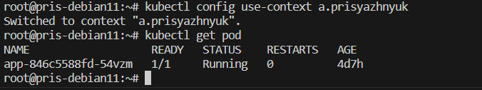

# Домашнее задание к занятию «Управление доступом»

### Цель задания

В тестовой среде Kubernetes нужно предоставить ограниченный доступ пользователю.

------

### Чеклист готовности к домашнему заданию

1. Установлено k8s-решение, например MicroK8S.
2. Установленный локальный kubectl.
3. Редактор YAML-файлов с подключённым github-репозиторием.

------

### Инструменты / дополнительные материалы, которые пригодятся для выполнения задания

1. [Описание](https://kubernetes.io/docs/reference/access-authn-authz/rbac/) RBAC.
2. [Пользователи и авторизация RBAC в Kubernetes](https://habr.com/ru/company/flant/blog/470503/).
3. [RBAC with Kubernetes in Minikube](https://medium.com/@HoussemDellai/rbac-with-kubernetes-in-minikube-4deed658ea7b).

------

### Задание 1. Создайте конфигурацию для подключения пользователя

1. Создайте и подпишите SSL-сертификат для подключения к кластеру.

``openssl genrsa -out a.prisyazhnyuk.key 2048``

`` openssl req -new -key a.prisyazhnyuk.key -out a.prisyazhnyuk.csr -subj "/CN=test/O=ops"``

``openssl x509 -req -in a.prisyazhnyuk.csr -CA /var/snap/microk8s/current/certs/ca.crt -CAkey /var/snap/microk8s/current/certs/ca.key  -CAcreateserial -out a.prisyazhnyuk.crt -days 5000``


2. Настройте конфигурационный файл kubectl для подключения.

``kubectl config set-credentials a.prisyazhnyuk --client-certificate=a.prisyazhnyuk.crt --client-key=a.prisyazhnyuk.key --embed-certs=true`

``kubectl config set-context a.prisyazhnyuk --cluster=microk8s-cluster --user=a.prisyazhnyuk``


3. Создайте роли и все необходимые настройки для пользователя.

```
apiVersion: rbac.authorization.k8s.io/v1
kind: Role
metadata:
  name: role-readpod1
  namespace: default
rules:
- apiGroups: [""]
  resources: ["pods", "pods/log"]
  verbs: ["watch", "list", "get"]

---

apiVersion: rbac.authorization.k8s.io/v1
kind: RoleBinding
metadata:
  name: bindin-reader
  namespace: default
subjects:
- kind: User
  name: a.prisyazhnyuk
  apiGroup: rbac.authorization.k8s.io
roleRef:
  kind: Role
  name: role-readpod1
  apiGroup: rbac.authorization.k8s.io
```

4. Предусмотрите права пользователя. Пользователь может просматривать логи подов и их конфигурацию (`kubectl logs pod <pod_id>`, `kubectl describe pod <pod_id>`).
5. Предоставьте манифесты и скриншоты и/или вывод необходимых команд.


------

### Правила приёма работы

1. Домашняя работа оформляется в своём Git-репозитории в файле README.md. Выполненное домашнее задание пришлите ссылкой на .md-файл в вашем репозитории.
2. Файл README.md должен содержать скриншоты вывода необходимых команд `kubectl`, скриншоты результатов.
3. Репозиторий должен содержать тексты манифестов или ссылки на них в файле README.md.

------

